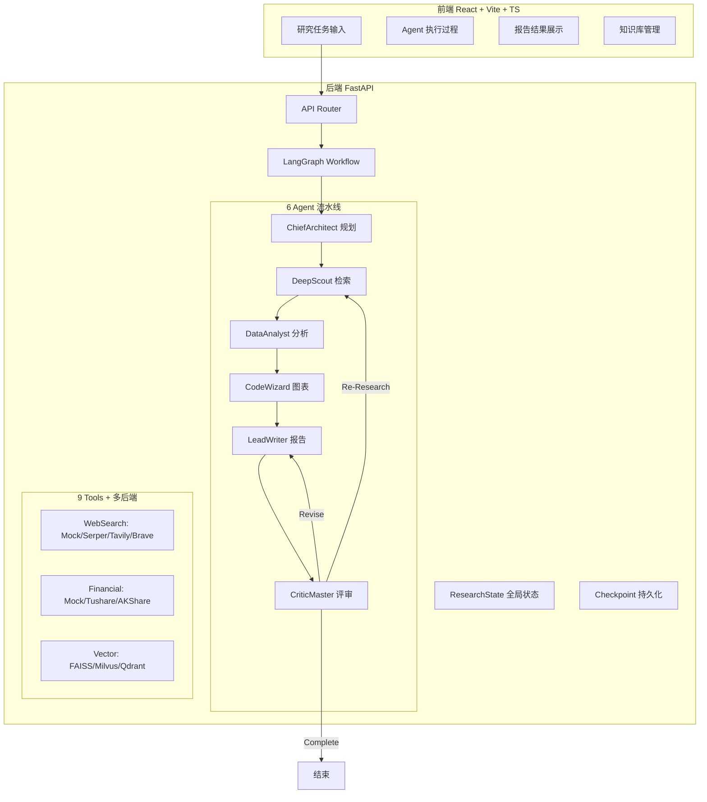

# Deep Research Agent Platform

> 面向行业分析与金融调研的多智能体深度研究 Agent 平台

[](https://www.python.org/)
[](https://fastapi.tiangolo.com/)
[](https://react.dev/)
[](https://www.typescriptlang.org/)

## 项目简介

面向行业分析、公司研究、金融调研、竞品分析、政策分析等高门槛研究场景，构建的企业级多智能体 Deep Research Agent 平台。

用户输入研究主题后，系统通过 **6 个专业 Agent 协作流水线**，自动完成：任务规划 → 信息检索 → 数据分析 → 图表生成 → 报告撰写 → 质量评审，最终生成**结构化中文研究报告**。

## 项目亮点

| 亮点 | 说明 |
|------|------|
| 🤖 **6 Agent 协作流水线** | ChiefArchitect → DeepScout → DataAnalyst → CodeWizard → LeadWriter → CriticMaster |
| 🧠 **LLM 驱动** | 支持 OpenAI / DeepSeek / 通义千问 / Kimi / GLM / Ollama 任意兼容 API |
| 🔍 **真实搜索** | 支持 Serper / Tavily / Brave 三种搜索引擎，Mock 降级可用 |
| 📊 **真实金融数据** | 支持 Tushare / AKShare 免费金融数据，Mock 降级可用 |
| 🗂️ **多向量数据库** | 支持 FAISS / Milvus / Qdrant 三种后端，即插即用 |
| 🔄 **ReAct + Reflection + Memory** | 每个 Agent 支持思考-行动-观察-反思循环 |
| 📊 **LangGraph 状态图** | 状态图工作流编排，智能路由，Checkpoint 持久化 |
| 🔍 **混合检索** | 向量检索 + BM25 关键词检索 + Hybrid 融合 |
| 📝 **Text2SQL + 安全校验** | NL→SQL + sqlglot 语法级安全校验，regex fallback |
| 🔒 **安全代码执行** | Python AST 安全检查 + 沙箱环境 |
| 📈 **ECharts 图表** | 6 种图表类型自动生成 JSON spec |
| ⭐ **7 维度质量评审** | 自动路由 Complete / Re-Research / Revise |
| 🗂️ **FunctionCall 数据 Pipeline** | 从日志构建训练数据，3,030 → 7,612 条 |

## 系统架构



## 快速开始

### 环境要求

- Python 3.11+
- Node.js 20+

### 1. 配置

```bash
cp .env.example .env
# 编辑 .env，填入 API Key（可选，不填则使用 Mock 数据）
```

### 2. 启动后端

```bash
cd backend
pip install -r requirements.txt
python -m uvicorn app.main:app --host 0.0.0.0 --port 8000 --reload
```

API 文档：http://localhost:8000/docs

### 3. 启动前端

```bash
cd frontend
npm install
npm run dev
```

前端页面：http://localhost:3000

### 4. Docker 启动

```bash
docker-compose up -d
```

## 配置说明

### LLM（可选，不配则走规则引擎）

```env
OPENAI_API_KEY=sk-your-key
OPENAI_BASE_URL=https://api.deepseek.com    # DeepSeek 推荐
LLM_MODEL=deepseek-chat
```

支持的提供商：OpenAI / DeepSeek / 通义千问 / Kimi / GLM / Ollama

### Web Search（可选，不配则用 Mock）

```env
SEARCH_API_TYPE=serper    # mock | serper | tavily | brave
SERPER_API_KEY=your-key   # https://serper.dev
```

### 金融数据（可选，不配则用 Mock）

```env
FINANCIAL_API_TYPE=akshare   # mock | tushare | akshare
```

### 向量数据库（可选，默认 FAISS）

```env
VECTOR_STORE_TYPE=faiss    # faiss | milvus | qdrant
```

## API 接口

| 方法 | 路径 | 说明 |
|------|------|------|
| POST | `/api/research/create` | 创建研究任务 |
| POST | `/api/research/run/{task_id}` | 启动研究 |
| GET | `/api/research/status/{task_id}` | 任务状态 |
| GET | `/api/research/result/{task_id}` | 研究结果 |
| GET | `/api/research/logs/{task_id}` | 执行日志 |
| POST | `/api/knowledge/upload` | 上传文档 |
| POST | `/api/knowledge/search` | 搜索知识库 |
| POST | `/api/sql/query` | Text2SQL 查询 |

## 示例 Demo

### Demo 1: 行业分析

```
输入：分析中国动力电池行业竞争格局
→ ChiefArchitect 生成 11 章节大纲
→ DeepScout 检索 30+ 条信息
→ DataAnalyst 分析 5 家公司财务数据
→ CodeWizard 生成市场份额饼图 + 营收对比柱状图
→ LeadWriter 撰写 4000+ 字中文报告
→ CriticMaster 评分 92 分 → Complete
```

### Demo 2: 公司对比

```
输入：对比宁德时代和比亚迪的财务表现
→ 雷达图多维对比 + 横向财务对比表
→ 完整竞品分析报告
```

### Demo 3: 综合研究

```
输入：分析低空经济行业政策、市场规模与风险因素
→ 政策梳理 + 市场趋势图 + 风险矩阵
→ 综合研究报告
```

## 项目结构

```
deep_research_agent_platform/
├── backend/
│   ├── app/
│   │   ├── main.py              # FastAPI 入口
│   │   ├── api/                  # 3 个路由模块
│   │   ├── agents/               # 6 个 LLM Agent
│   │   ├── graph/                # 工作流 + 路由
│   │   ├── state/                # 状态 + Checkpoint
│   │   ├── tools/                # 9 个工具
│   │   │   └── backends/         # 多后端适配器
│   │   ├── llm/                  # LLM 客户端
│   │   ├── memory/               # 双记忆系统
│   │   ├── db/                   # ORM + 模型
│   │   ├── services/             # 业务服务
│   │   └── utils/                # 配置/日志/安全
│   ├── data/                     # Mock 数据
│   ├── data_pipeline/            # FunctionCall 数据构建
│   └── tests/                    # 测试
├── frontend/                     # React + Vite
├── docs/                         # 文档
├── docker-compose.yml
├── .env.example
└── README.md
```

## 测试

```bash
cd backend
pytest tests/ -v
```

## 文档

- [系统架构](docs/architecture.md)
- [Agent 工作流](docs/agent_workflow.md)
- [Demo 案例](docs/demo_cases.md)
- [FunctionCall 数据构建](docs/function_call_dataset.md)

## License

MIT
